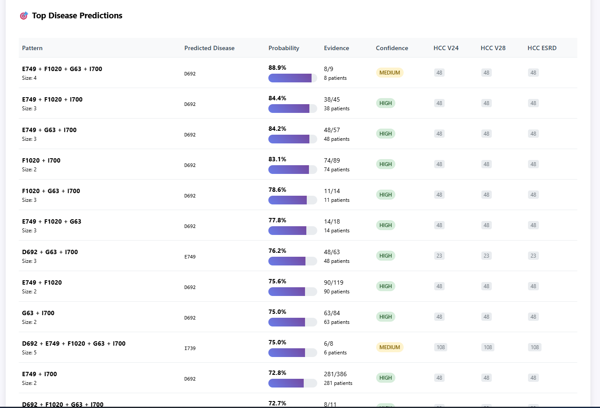
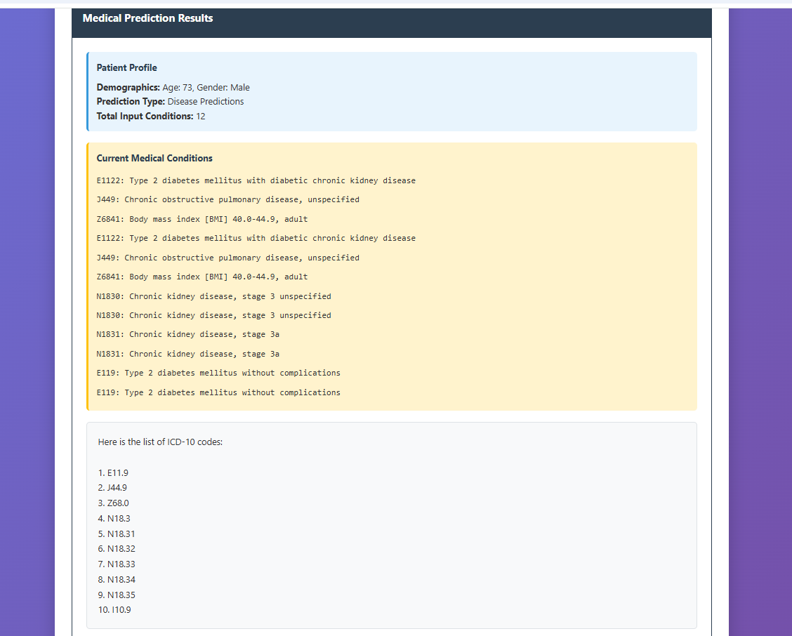

# ICD Stat




## Overview

**ICD Stat** is a web application designed to facilitate analysis and visualization of ICD (International Classification of Diseases) statistics. Built using Python and HTML, this project enables users to explore, filter, and display disease data interactively.

## Features

- Interactive dashboard for ICD statistics
- Data filtering and visualization
- Easy-to-use web interface
- Export and download options for reports

## Technologies Used

- **Python**: Backend logic and data processing
- **HTML**: Frontend structure and presentation

## Getting Started

1. **Clone the repository:**
   ```bash
   git clone https://github.com/masoom-patel/icd_stat.git
   ```
2. **Install requirements:**
   ```bash
   pip install -r requirements.txt
   ```
3. **Run the application:**
   ```bash
   python app.py
   ```
4. Open your browser and go to `http://localhost:5000`

## LLM-Based Reasoning

An LLM-based version is also available, providing reasoning-based outcomes. This feature aims to enhance explainability and is planned to be merged soon.
